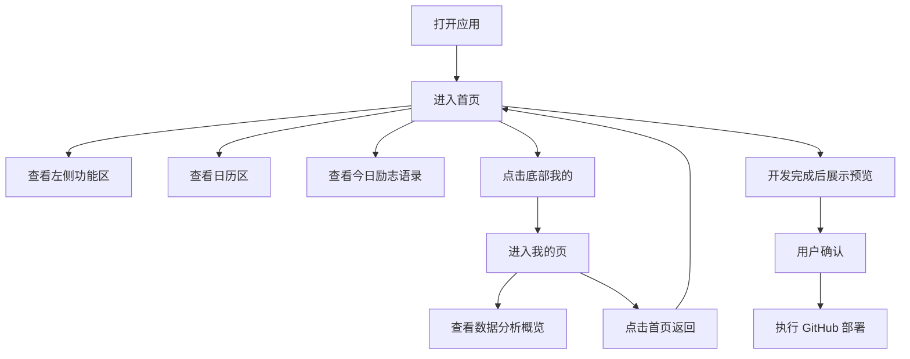

## 1. 产品概述
这是一个根据手绘草图开发的桌面优先日记/记录型前端页面原型，重点是还原草图布局与信息层级，并提供可演示的基础交互。
- 主要服务于需要查看日历、切换侧边工具、阅读今日励志语录以及在“我的”页查看数据分析概览的个人用户
- 首版以本地静态数据完成演示，先交付预览确认，再进行 GitHub 部署相关操作

## 2. 核心功能

### 2.1 功能模块
1. **首页**：左侧功能入口、中间日历区、右侧今日励志语录卡片、底部导航
2. **我的页**：个人信息摘要、数据分析卡片、趋势可视化占位、底部导航

### 2.2 页面详情
| 页面名称 | 模块名称 | 功能描述 |
|-----------|-------------|---------------------|
| 首页 | 左侧功能区 | 竖向展示“待办”“计时器”“笔记”，支持选中态切换 |
| 首页 | 日历区 | 展示当前月份日历、当天高亮与简要月份信息 |
| 首页 | 今日励志语录 | 展示图片占位、标题、日期、时间与励志语录文案 |
| 首页 | 底部导航 | 支持“首页”“我的”切换，并展示当前选中状态 |
| 我的页 | 个人摘要 | 展示头像占位、名称、累计记录摘要 |
| 我的页 | 数据分析 | 展示关键统计卡片、周趋势图表、习惯概览 |
| 我的页 | 导航返回 | 支持返回首页并保留整体视觉风格一致性 |

## 3. 核心流程
用户打开页面后默认进入首页，查看左侧功能入口、中间日历和右侧励志语录；用户可点击左侧入口查看选中反馈，也可通过底部导航切换到“我的”页查看数据分析概览，随后再切回首页。开发完成后提供本地预览给用户确认，确认后才执行 GitHub 部署。

## 4. 用户界面设计
### 4.1 设计风格
- 主色调：米白纸张色、深墨黑、灰蓝辅助色、低饱和暖棕点缀
- 按钮风格：圆角矩形搭配手绘描边与轻微投影，选中态使用更深底色
- 字体与字号：标题采用有书写感的中文展示字体，正文采用清晰宋黑混合风格，突出纸面排版感
- 布局风格：桌面优先的双栏主区域布局，左中右分区明确，底部悬浮式双导航
- 图标建议：使用简洁线性图标或手绘符号感图形，避免过度拟物

### 4.2 页面设计概览
| 页面名称 | 模块名称 | UI 元素 |
|-----------|-------------|-------------|
| 首页 | 左侧功能区 | 竖向按钮、纸片卡片感背景、悬停高亮、选中描边 |
| 首页 | 日历区 | 大号月份标题、规则网格、当天高亮、留白充足 |
| 首页 | 今日励志语录 | 手账式卡片、图片占位、日期时间文本、重点语录排版 |
| 首页 | 底部导航 | 居中悬浮导航条、两枚主按钮、清晰选中态 |
| 我的页 | 数据分析 | 统计卡片、简洁图表、进度条、分区卡片布局 |

### 4.3 响应式设计
- 采用桌面优先设计，优先适配草图对应的横向布局
- 在较窄屏宽下退化为上下分区布局，保证内容仍可阅读
- 交互元素保留足够点击面积，适配触控与鼠标操作
