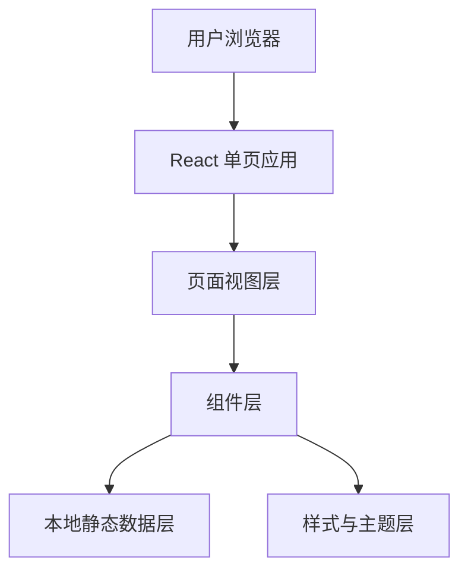

## 1. 架构设计


## 2. 技术描述
- 前端：React 18 + Vite + 原生 CSS
- 初始化工具：Vite
- 后端：无
- 数据：本地 mock 静态数据
- 图表：优先使用原生 CSS/SVG 实现简易可视化，避免引入不必要依赖

## 3. 路由定义
| 路由 | 用途 |
|-------|---------|
| / | 首页与我的页所在的单页入口 |

## 4. 数据定义
### 4.1 页面状态模型
```ts
type SideTool = "待办" | "计时器" | "笔记";
type BottomTab = "首页" | "我的";

interface QuoteCard {
  title: string;
  dateText: string;
  timeText: string;
  quote: string;
  imagePromptLabel: string;
}

interface StatsCard {
  label: string;
  value: string;
  detail: string;
}

interface TrendPoint {
  label: string;
  value: number;
}
```

### 4.2 本地数据策略
- 首页使用固定的励志语录、日期、时间和图片占位描述
- 数据分析页使用固定统计数据和简易趋势数组
- 所有数据集中在前端单独的数据模块，便于后续替换为真实接口

## 5. 组件拆分
- `App`：管理当前底部导航与左侧工具选中状态
- `SidebarTools`：渲染“待办”“计时器”“笔记”入口
- `CalendarPanel`：渲染当前月份日历
- `QuotePanel`：渲染今日励志语录卡片
- `BottomNav`：渲染首页/我的切换
- `ProfileDashboard`：渲染“我的”页数据分析内容

## 6. 样式策略
- 使用 CSS 变量统一颜色、阴影、圆角和边框风格
- 使用多层背景、细边框和轻微旋转感提升手账纸张视觉
- 通过 `grid` 和 `flex` 构建主布局，并在窄屏下切换为单列
- 动效以悬停、淡入和轻微位移为主，避免复杂动画影响首版交付速度

## 7. 工程约束
- 首版不接入后端、不接入登录系统
- 首版不包含真正的待办、计时器、笔记编辑功能，仅提供入口和视觉反馈
- GitHub 部署必须在用户确认预览效果后再执行
